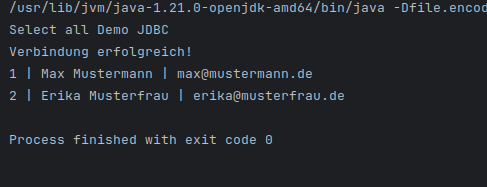
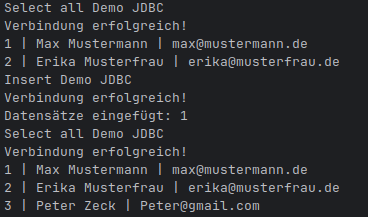
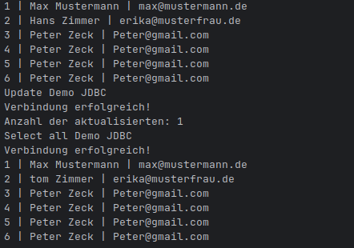

# yml script
```
services:
  db:
    image: mysql:8
    environment:
      MYSQL_ROOT_PASSWORD: 12345
      MYSQL_DATABASE: jdbcdemo
      MYSQL_USER: user
      MYSQL_PASSWORD: 12345
    ports:
      - "3306:3306"
    volumes:
      - db_data:/var/lib/mysql
volumes:
  db_data:
```
# SQL Script für datenbank Grundstrucktur
```
USE jdbcdemo;
CREATE TABLE student (
    id INT AUTO_INCREMENT PRIMARY KEY,
    name VARCHAR(255) NOT NULL,
    email VARCHAR(255) NOT NULL
);

INSERT INTO student (name, email) VALUES ('Max Mustermann', 'max@mustermann.de');
INSERT INTO student (name, email) VALUES ('Erika Musterfrau', 'erika@musterfrau.de');

# SQL-Befehle Teil 2 - DAO Pattern
USE jdbcdemo;

DROP TABLE IF EXISTS courses;

CREATE TABLE courses (
    id INT PRIMARY KEY AUTO_INCREMENT,
    name VARCHAR(100) NOT NULL,
    description TEXT,
    hours INT,
    begindate DATE,
    enddate DATE,
    coursetype VARCHAR(50)
);

INSERT INTO courses (name, description, hours, begindate, enddate, coursetype) VALUES
('Introduction to SQL', 'Learn the basics of SQL and database management.', 9, '2025-01-15', '2026-02-15', 'OE'),
('Advanced Java Programming', 'Deep dive into advanced Java concepts and frameworks.', 2, '2024-03-01', '2024-04-30', 'ZA'),
('Web Development Bootcamp', 'Comprehensive course on front-end and back-end web development.', 1, '2025-05-10', '2025-07-10', 'FF'),
('Data Science with Python', 'Explore data analysis, visualization, and machine learning using Python.', 4, '2024-08-01', '2024-09-30', 'FF'),
('Project Management Fundamentals', 'Learn essential project management skills and methodologies.', 3, '2026-10-05', '2026-11-05', 'OE');
```
# Bearbeiten der Pom File in Teil1
```
        <dependency>
            <groupId>com.mysql</groupId>
            <artifactId>mysql-connector-j</artifactId>
            <version>9.5.0</version>
        </dependency>
```


# Code bis Kapitel 4
```
import java.sql.Connection;
import java.sql.DriverManager;
import java.sql.PreparedStatement; // <--- FEHLTE
import java.sql.ResultSet;        // <--- FEHLTE
import java.sql.SQLException;

public class JdbcDemo {

    public static void main(String[] args) {
        selectAllDemo();
    }

    public static void selectAllDemo() {
        String user = "user";
        String pwd = "12345";
        System.out.println("Select all Demo JDBC");

        String connectionUrl = "jdbc:mysql://localhost:3306/jdbcdemo";

        try (Connection conn = DriverManager.getConnection(connectionUrl, user, pwd)) {
            System.out.println("Verbindung erfolgreich!");

            PreparedStatement preparedStatement = conn.prepareStatement("SELECT * FROM student");
            ResultSet rs = preparedStatement.executeQuery();

            while (rs.next()) {
                int id = rs.getInt("id");
                String name = rs.getString("name");
                String email = rs.getString("email");
                System.out.println(id + " | " + name + " | " + email);
            }

        } catch (SQLException e) {
            System.out.println("Fehler beim Aufbau: " + e.getMessage());
        }
    }
}

```
## ergebnis der erfolgreicehen verbindeung


# Video 5 

```
    public static void InsertStudent() {
        String user = "user";
        String pwd = "12345";
        System.out.println("Insert Demo JDBC");

        String connectionUrl = "jdbc:mysql://localhost:3306/jdbcdemo";

        try (Connection conn = DriverManager.getConnection(connectionUrl, user, pwd)) {
            System.out.println("Verbindung erfolgreich!");

            String sql = "INSERT INTO student (id, name, email) VALUES (NULL, ?, ?)";
            PreparedStatement preparedStatement = conn.prepareStatement(sql);

            preparedStatement.setString(1, "Peter Zeck");
            preparedStatement.setString(2, "Peter@gmail.com");

            int rowsAffected = preparedStatement.executeUpdate();
            System.out.println("Datensätze eingefügt: " + rowsAffected);

        } catch (SQLException e) {
            System.out.println("Fehler: " + e.getMessage());
        }
    }
``` 
## Ergebnis 


# Video 6
## Ergebnis

## Code 
``` 
public static void UpdateStudent() {
        String user = "user";
        String pwd = "12345";
        System.out.println("Update Demo JDBC");

        String connectionUrl = "jdbc:mysql://localhost:3306/jdbcdemo";

        try (Connection conn = DriverManager.getConnection(connectionUrl, user, pwd)) {
            System.out.println("Verbindung erfolgreich!");

            String sql = "UPDATE student SET name = ? WHERE id = 2";
            PreparedStatement preparedStatement = conn.prepareStatement(sql);

            try {
                preparedStatement.setString(1, "tom Zimmer");
                int rowsAffected = preparedStatement.executeUpdate();
                System.out.println("Anzahl der aktualisierten: " + rowsAffected);

            } catch (SQLException ex) {
                System.out.println("Fehler: " + ex.getMessage());
            }

        } catch (SQLException e) {
            System.out.println("Fehler: " + e.getMessage());
        }
    }
``` 

# Video 7
## Ergebnis 

## Code

``` 

``` 

